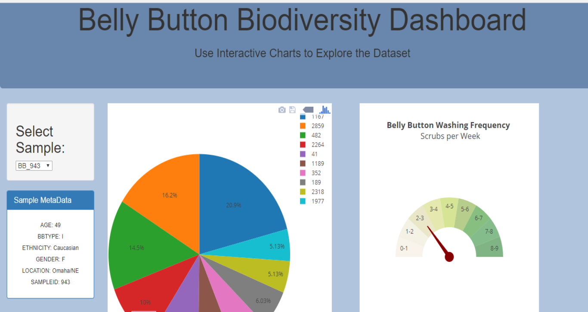
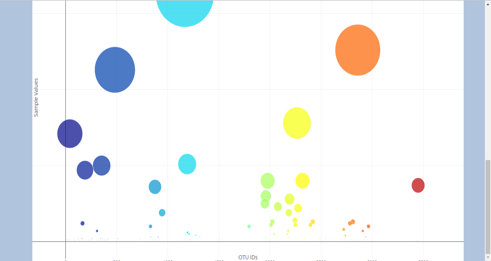

# JavaScript-APIs-and-SQLAlchemy
Create Flask API to serve the HTML and JavaScript required for dashboard page and Plotly.js to build interactive charts for dashboard.

# Belly Button Biodiversity

https://belly-button-biodiversity-2018.herokuapp.com/

In this assignment, I will build an interactive dashboard to explore the [Belly Button Biodiversity DataSet](http://robdunnlab.com/projects/belly-button-biodiversity/).

## Step 1 - Flask API

Use Flask to design an API for the dataset and to serve the HTML and JavaScript required for the dashboard page. Note: I used the sqlite database file and SQLAlchemy inside of my Flask application code.

* First, create a template called `index.html` for your dashboard landing page. Use the Bootstrap grid system to create the structure of the dashboard page.

* Next, create Flask API.

## Step 2 - Plotly.js

Use Plotly.js to build interactive charts for the dashboard.

 *  Create a PIE chart that uses data from the routes /samples/<sample> and /otu to display the top 10 samples.
 *  Create a Bubble Chart that uses data from the routes /samples/<sample> and /otu to plot the Sample Value vs the OTU ID for the selected sample.

 *  Display the sample metadata from the route /metadata/<sample>

 *  Create the Gauge Chart to plot the Weekly Washing Frequency obtained from the route /wfreq/<sample>

 *  Use Plotly.restyle to update the chart whenever a new sample is selected.

* Finally, deploy your Flask app to Heroku.
https://belly-button-biodiversity-2018.herokuapp.com/
